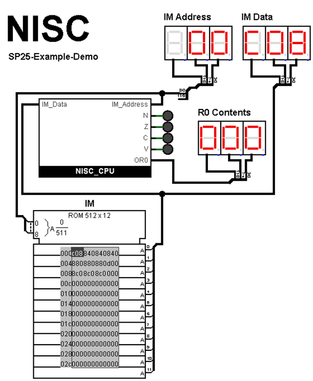
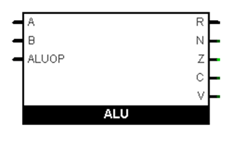
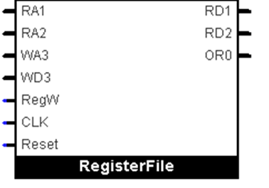
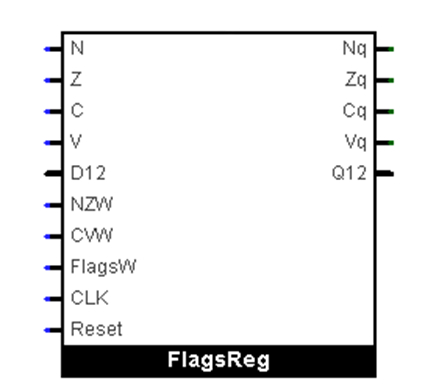
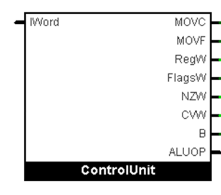
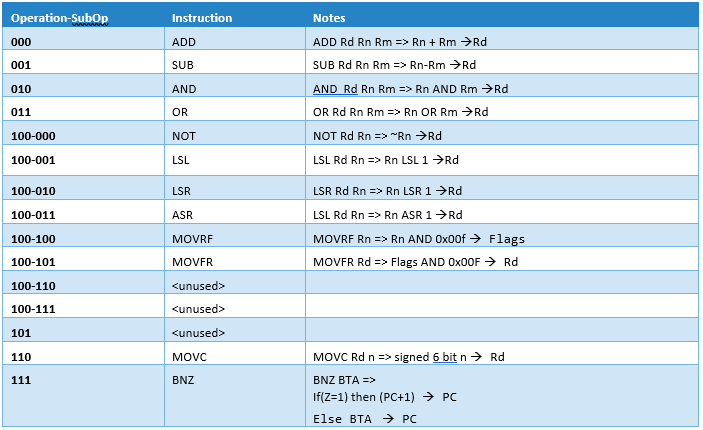

# Lab 3B :: NISC CPU Lab

The primary task of this lab is the design and construction of a simulated CPU in Logisim. You will be building a version of NISC a very minimal arm-like CPU. Take a look at Appendix 1 for a detailed description of the NISC CPU.

## Requirements

For this lab you will be required to use the version of Logisim Evolution specified in the course modules. This is to maintain compatibility with grading scripts should my graders need to use them, and/or, to ensure that my graders can load your file without error. There are some additional strict requirements regarding the shell files that are given to you. You may not rename any ports or modules that are provided. Do not add any additional pins to the top-level module or the CPU module. 

## Overview

You have been provided with a Logisim file that provides the front panel shown above along with the implemented front panel. You are also provided with the ROM that is the instruction memory on the front panel. The reason for putting the ROM outside of the CPU is to make loading programs less tedious. You have been provided with an empty shell for the CPU module. Building this module is your task for this lab.

Our focus in this lab is in building a CPU and understanding the detail involved. Consequently, you are not restricted to using simple logic gates. You may use many of the powerful features available in Logisim Evolution. Do not worry about minimization of gates, rather, focus on building a reliable CPU and understanding the relationship between programming and CPU architecture. For some modules you are required to use the circuits  that you have already created in part one of this lab

## Submission

Full submission details will be provided on Canvas. However, you can expect three things with this project. First, you must do a writeup, second, you must submit a .circ file created and edited only with Logisim Evolution using the correct version, and third, you will be creating a short (two minutes max runtime) of you demonstrating the operation of your CPU.

## Building The CPU

You will want to build the CPU in phases. After building up the various components you will test them by executing small assembly language programs that test only the features implemented so far. Take this part seriously, you will be required to include your test programs in your writeup.

## Build the Instruction Fetch Unit

Your first task is to build out the instruction circuit. The instruction fetch unit is responsible for fetching the next instruction to execute. Figure 7.8 in your book gives you a rough outline of the functionality of this module. The B tunnel shown here is, in essence, the PCSrc controller output shown in figure 7.8. This line goes high whenever the CPU is executing some kind of branch. Since this is where we implement the program counter register, it is essential that it be connected to the system-wide Reset and Clk signals. This way, when you reset the CPU, the program counter will reset to zero. A discussion of how this works starts on page 393 of your textbook. Note that for this project, this circuit is almost identical to the the FISC circuit and you have permission to modify  that circuit.

While building this it’s important to keep some details in mind. A real ARM CPU uses byte aligned memory and 32-bit data words. This means that the next instruction is at PC+4. We are using word-aligned memory with 12-bit words. So, for us, the next instruction is at the next location in memory. Also, in ARM, R15, which is the PC register, always holds PC+8, or two instructions ahead. Your book mentions that this is for historical reasons. We are sticking with the FISC convention in that the PC is not otherwise accessible, and, that the branch target address (BTA) is absolute and not relative.

If you build this unit correctly, you should be able to step through memory full of zeros and see the instruction memory increase by one on every step. You should see the contents of the instruction memory on the instruction memory data display. Resetting the simulation (ctrl-R) should return the instruction memory address to zero.

## Build the ALU

The ALU should seem quite familiar to you. It takes two 12-bit inputs, A and B, and provides a 12-bit Result as well as the flags N, Z, C, V, via individual outputs. The ALUOP input is a three-bit input that determines the operation that the ALU will perform. For this project this must adhere to the following eight operations in order starting at zero: Add, Subtract., And, Or, Not, LSL, LSR, ASR. As discussed in Appendix 1, you will have to map the CPU op to the ALU op inside the controller.

Start with the pieces that you built in the first part and build out your ALU inside the provided empty subcircuit. Note, that the flag outputs are raw, that is, the ALU does not contain the flag registers.

You will have to complete more work to use this in your CPU, however, you should have enough experience with building ALUs in the previous lab that this should be fairly easy for you to test and get working.  Unlike previous labs, circuit minimality is not the goal here. Consequently, you may use all of the arithmetic functions within Logisim so long as the subcircuit in general was not a part of the last assignment, e.g., you must use your 12 bit Ripple adder subtractor constructed from 3 of your 4 bit CLAs. The flags N, Z, C, V, are negative, zero, carry, and overflow respectively as defined in your text.

## Build the Register File

The register file is an 8x12-bit three ported memory. For this problem you may want to use Logisim’s demultiplexer for routing input data to the appropriate register.  A demultiplexer is a multiplexer in reverse. Based on the select input, the single data input is routed to one of the data outputs. The RA1 input provides the three-bit address for the register that will be read on the RD1 data output, the RA2 input provides the three-bit address for the register that will be read on the RD2 data output, and the WA3 input provides the three-bit address for the register that will be written via the WD3 data input. The RegW  input enables writing to the register addressed by RA3. Thus, in order to write to the register specified by RA3, the data must be present on WD3 and the RegW input must be at a logic high. If these conditions are true then the data is writing on the next clock cycle. The OR0 output is simply a 12 bit output tied to R0 (Ouput Register 0). This so that we can always see the contents of R0 on the front panel hex display.

 

For the internals you may use Logisim registers. Be sure to connect Reset and Clk so that the registers reset to zero on system reset. You should have most of this already complete. Modify your solution for part A to fit into this circuit.

## Thinking Through the FLAGS Register

You already know what the N, Z, C, and V flags represent and why they matter. The challenge now is implementing a FLAGS register that updates them correctly—and selectively—based on the instruction being executed. The key is not to try and build the whole thing at once. Start small, get something working, and build from there.

The first step is to split the FLAGS register into two two-bit registers: one for N and Z, and one for C and V. These pairs are updated under different conditions, and separating them makes it easier to control which parts get written and when. You don’t need any fancy logic at this point—just wire up each 2-bit register with a clock and a reset, and make sure you can write values into them.

Once you’ve done that, focus on getting the write enable signals working. You should have two: one that enables updates to the NZ pair, and one for the CV pair. These should come from your control unit (NZW and CVW). Test this by routing values from your ALU directly into the flag inputs and confirming that only the appropriate pair of flags is updated when each signal is active. You can simulate this by using simple test programs that trigger different flag conditions (e.g., adding zero, subtracting a larger number, etc.).

After that’s working, it’s time to think about MOVRF, the instruction that loads flag values directly from a register. This is where the FlagsW signal comes in. Unlike NZW or CVW, FlagsW doesn’t write anything by itself—it’s a control signal that changes where the input comes from. Normally, the flags are updated from the ALU. But if FlagsW is asserted, the source becomes a separate 12-bit bus that is routed in through D12. Just use the 12 bit input from your datapath and split off the lower four bits inside your FlagsReg circuit. This means you need to add a small MUX in front of each flag pair to choose between the ALU output and the external value. 

When you’re ready to add this feature, do it carefully. The write still happens under the control of NZW or CVW, but now those enables must be ORed with the output of FlagsW to control which input path the MUX selects. This way, you don’t accidentally update flags from both sources at once. You’ll need to test MOVRF separately and confirm that it doesn’t clobber flags when it shouldn’t.

By breaking the problem down this way—first the registers, then the basic enables, then the override path—you'll avoid the trap of debugging too much logic at once. Every step builds on the last, and each can be tested in isolation with simple assembler programs. When it’s done, you’ll have a clean, modular FLAGS unit that behaves exactly how your controller expects it to.

## Overview of the Decoder/controller

Your control unit takes the 12-bit instruction word (IWord) and produces control signals that determine how data flows through the CPU on each clock cycle. The output signals shown here allow the controller to select ALU operations, update the FLAGS register, write to general-purpose registers, and route data through muxes on the datapath. These signals do not all apply to every instruction, and understanding which ones to assert—and when—is key to a working CPU.

MOVC is asserted when the current instruction is MOVC. This signal causes the sign-extended constant (from bits [8:3] of the instruction word) to be selected as the input to the ALU's B-side or, depending on your implementation, routed directly to the writeback path. It should also result in the immediate value being written into the destination register Rd. Only the MOVC instruction asserts this signal.

MOVF is used for the MOVFR instruction, which moves the FLAGS register into a general-purpose register. This signal modifies the writeback path so that the FLAGS are routed into the destination register rather than the ALU result or a constant. MOVF should be asserted only for MOVFR. It is not asserted for MOVRF.

RegW is the register file write enable signal. It should be asserted for any instruction that writes to a general-purpose register, including MOVC, all ALU operations, most two-operand instructions (like NOT, LSL, MOVFR), and others. It should be left deasserted for instructions that do not produce a result to store in a register, such as BNZ or MOVRF.

FlagsW is the signal used to write all four flags (N, Z, C, V) to the FLAGS register. It is asserted only by the MOVRF instruction, which moves the lower 4 bits of a general-purpose register into the FLAGS. This path uses a dedicated 12-bit input to the FLAGS register. This is distinct from partial flag updates triggered by arithmetic or logic operations.

NZW is the enable signal for updating the N (negative) and Z (zero) flags based on the ALU result. It should be asserted for all ALU-based instructions that affect condition codes—such as ADD, SUB, AND, OR, NOT, LSL, LSR, and ASR. It should be deasserted for instructions like MOVC, MOVFR, MOVRF, and BNZ, where the result is either not computed through the ALU or is not meaningful for setting flags.

CVW is the carry and overflow flag write enable signal. It should be asserted only for ADD and SUB, the two instructions capable of generating meaningful carry or overflow behavior. No other instructions modify these flags, and their values should persist unless explicitly updated.

B is used to select the source for the ALU’s second input (input B). When B is high, the ALU receives its second operand from the sign-extended immediate constant (used only in MOVC). When B is low, the second input comes from the second source register (Rm). This signal is essential for choosing between register-register and immediate-based operations.

ALUOP is the select signal sent to the ALU to determine which of its eight supported operations to perform. The ALU supports: ADD, SUB, AND, OR, NOT, LSL, LSR, and ASR. The control unit must construct this 3-bit signal by decoding both the Op field (for 3-register instructions like ADD, SUB, etc.) and the SubOp field (for 2-register instructions like NOT, LSL, etc.). The ALU does not distinguish between instruction types—it simply receives an operation code that selects one of the eight functions.

## Developing the DataPATH and Controller

Now that you've worked through the instruction formats and understand how they are encoded, you're ready to begin building your control unit and testing your datapath. You’ll want to develop the system gradually, adding support for one instruction at a time and verifying that each piece works before moving on. Because the instruction word layout is compact and uniform, and because you’ve been given a working Python assembler, you don’t need to waste time hand-assembling instructions. Use the assembler to generate ROM images and focus your effort on wiring and debugging your design.

Start by building just enough of your controller and datapath to support the MOVC instruction. This instruction is ideal for early testing because it lets you load known constants into any register without relying on any other features. It also touches several key pieces of the system—register write, immediate decoding, ALU bypassing, and sign extension—so it forces you to get the basics right. If MOVC works, you'll have enough foundation to begin testing ALU operations, flag behavior, and later, control flow.

Keep in mind that the immediate value for MOVC is located in the middle six bits of the instruction word. These are bits [8:3], and they must be extracted and sign-extended to 12 bits before use. You’ll need to build a small sign extension circuit to handle this. Then, use a multiplexer to choose between the immediate constant and the RD2 output of the register file as the second operand for the ALU. This mux corresponds to the textbook’s ALUSrc control signal. You will also eventually need another mux to select what value is written back to the register file—either the ALU result, the constant, or the FLAGS—but for now, you can hardwire that path to get MOVC working.

Once the immediate is sign-extended and routed correctly, and the destination register is correctly written via the WD3 path, you should be able to load values into any of the general-purpose registers. This gives you everything you need to start testing and debugging your design incrementally. Use the Python assembler to write small test programs, and load them into your ROM. Verify register values using probes or front panel indicators.

After you’ve verified MOVC, move on to implementing the ALU instructions: ADD, SUB, AND, and OR. These are all three-operand instructions and share the same basic structure. You’ll need to decode the top three bits of the instruction to determine the operation, and route the appropriate values from Rn and Rm into the ALU. The result should be written back to Rd, and you should also assert the appropriate signals to update the FLAGS register. This is a good time to verify that your FLAGS register is updating correctly for ALU instructions—remember that only ADD and SUB update the carry and overflow bits; all ALU instructions should update the N and Z flags.

As you add each instruction, test it in isolation, then combine it with previous instructions to ensure that your modifications haven't broken earlier functionality. Save your assembler programs and ROM images to allow for easy regression testing. Most programs will be short—often just a few lines—but they should be purpose-built to test a specific instruction or feature.

This cycle—add a new instruction, write a test case, verify behavior—is the core workflow for completing this project. You’ll gradually add more control signals and datapath components as needed. Keep your design modular and flexible; it’s likely you’ll need to revise parts of your controller as you encounter new requirements.

In the final stretch of the project, you’ll flesh out full support for the two-operand instructions (shifts, NOT, and flag manipulation), as well as the BNZ control flow instruction. Each new instruction will build on the structure you’ve established and give you a deeper understanding of how each part of the CPU communicates with the rest.

The design is small, but it’s not trivial. Pay attention to details like instruction field positions, routing decisions, and especially the FLAGS behavior. Debug incrementally and keep your test programs organized. The more intentional you are in testing and refactoring, the cleaner your final design will be.

## Working with ROM Images

Your Logisim CPU uses an external ROM to hold instruction memory, and you’ll load programs into it by importing ROM image files. These files are simple text files where each line represents a 12-bit machine word in hexadecimal. Logisim expects these files to start with the line v2.0 raw, followed by one hex word per line.

As you develop your CPU, you’ll write small assembly programs and use the assembler to produce these ROM image files. Once assembled, load them into the ROM by right-clicking the ROM component and selecting Load Image. You can save and reuse these files to retest functionality after changes. This makes it easy to build a library of small test programs to verify your design incrementally as it grows.

## Using the Provided Assembler

To streamline your workflow, you’ve been provided with a Python assembler called nisc.py. This tool takes your .asm source file and outputs a machine code file formatted for Logisim's ROM.

To assemble a file, run the following command from the terminal:

python3 nisc.py yourfile.asm > yourfile.hex

This will read your assembly source (yourfile.asm) and write the output as a plain text file (yourfile.hex) with one 12-bit word per line in Logisim-compatible format. You can then load this .hex file directly into your ROM using Logisim’s “Load Image” option.

Each time you test a new instruction or feature, you should update your .asm file, re-run the assembler, and reload the ROM. This lets you iterate quickly and confirm your hardware changes are working as expected.

For very short programs of only 1 to 3 instructions, you might find it faster to just leave off the file redirection and manually edit the ROM contents.

 
## Appendix 1 :: NISC-SP25 :: The 12-Bit ARM Like CPU :: Technical Description (V001)

The NISC CPU is a minimal CPU that has a structure somewhat similar to the ARM CPU model presented in your textbook. The driving idea for this project is that the discussion in the book should be a helpful resource while you work on developing your own implementation of this CPU. NISC stands for Nine to Nineteen Instruction Set Computer. Which, admittedly, is a bit arbitrary, but it roughly captures the range of instructions that you can implement with this machine. In this lab you are implementing twelve instructions.

## NISC-SP25 Overview

The NISC-SP25 CPU is a simplified educational processor that uses a 12-bit instruction word and a single-cycle RISC-style architecture. Each instruction is fully encoded within a single 12-bit word. Unlike more complex designs, this CPU eliminates general-purpose data memory entirely to streamline its implementation and make datapath behavior easier to understand and simulate.

The CPU follows a Harvard-style architecture with separate instruction memory. Instructions are fetched via a dedicated address bus (IM_Address) and data bus (IM_Data) connected to an external ROM. This clean separation reinforces the distinction between instruction control flow and data manipulation. The NISC CPU is able to access 512 bytes of (12-bit) word aligned instruction memory.

The register file contains 8 general-purpose registers, labeled R0 through R7. Of these, R0 is special: it is mapped to an output display. Writing to R0 causes the value to be shown externally, making it suitable for visualizing output in simulation environments like Logisim. All other registers are general-purpose and used freely in arithmetic, logic, and control instructions.

The instruction set includes standard 3-operand arithmetic and logic operations, a set of 2-operand instructions (including logical NOT, shifts, and flag movement), and control instructions like MOVC (load constant) and BNZ (branch if not zero). There are no memory load/store operations; all computation is register-based.

The FLAGS register captures condition results such as zero, negative, carry, and overflow from the ALU. It is updated automatically by ALU operations and can also be explicitly written using the MOVRF instruction (copy lower 4 bits of a register into FLAGS) or read using MOVFR (copy FLAGS into the lower 4 bits of a register).

## NISC-SP25 Instruction Basics

The NISC-SP25 CPU supports a minimal but expressive set of instructions designed for simplicity and clarity in educational contexts:

    Arithmetic and logical operations use a standard three-operand format: two source registers and one destination register. Examples include ADD, SUB, AND, and OR. A few operations, like NOT, use a two-operand format where the result is written to a separate destination register.
    Immediate and system-related operations include MOVC, which loads a small signed constant into a register. The architecture also includes MOVRF and MOVFR for explicit interaction with the FLAGS register. There are no memory load or store instructions—computation is entirely register-based.
    Control flow instructions include conditional branches such as BNZ (branch if not zero). There is no dedicated HALT or NOP instruction, but an infinite self-loop (e.g., BNZ label where label: is the same instruction) can be used to halt the processor.

Programming the NISC-SP25 is similar in spirit to writing basic assembly programs for a RISC processor like ARM, but much simpler. There is no call stack, subroutine mechanism, or interrupt support. Additionally, because NISC-SP25 uses 12-bit instruction encoding and has a custom architecture, it is not compatible with ARM binary tools or standard compilers.

This design emphasizes clarity in instruction decoding and control signal generation, making it ideal for students learning datapath and control logic in a hands-on environment.

The rest of this document contains detailed descriptions of the instruction word format and the instructions.
NISC-SP25 Instruction Word Format

The NISC-SP25 CPU uses a simplified and compact instruction format based on a fixed 12-bit instruction word. Unlike more complex architectures like ARM, which differentiate heavily between instruction types and support large immediate fields, NISC-SP25 embraces minimalism to maximize clarity in design and ease of implementation.

Because the instruction word is only 12 bits wide, NISC-SP25 uses a small number of carefully chosen formats, grouped primarily by the number and type of operands: register-only operations, register+immediate operations, and branch instructions.

Instruction Formats

The instruction word format depends on the instruction type. There are four main formats:

    1. 3-Operand Register Format (ALU operations)
    Format: OP:3 Rm:3 Rn:3 Rd:3
    These instructions specify two source registers and one destination register. Examples include ADD, SUB, AND, and OR.
    2. 2-Operand Register Format (special operations)
    Format: OP:3 SubOP:3 Rn:3 Rd:3
    This is used for unary or specialized operations like NOT, LSL, LSR, and ASR, as well as flag movement (MOVRF, MOVFR). The SubOP field selects the operation, and the instruction behaves accordingly.
    3. Immediate Constant Format (MOVC)
    Format: OP:3 Imm:6 Rd:3
    This format is used by the MOVC instruction to load a 6-bit signed immediate constant into a register. The limited immediate field is a consequence of the 12-bit instruction size, but the tradeoff keeps the format simple and decoding easy.
    4. Branch Format (BNZ)
    Format: OP:3 BTA:9
    The BNZ (branch if not zero) instruction uses a 9-bit unsigned branch target address. It is unconditional with respect to PC-relative offsets; instead, it provides a direct target address, making implementation easier in this fixed instruction model.

### Design Philosophy and Tradeoffs

With only 12 bits available per instruction, the NISC-SP25 CPU prioritizes consistency and simplicity over flexibility. Unlike ARM, where immediate values may appear in many instruction types, NISC-SP25 confines constants to the MOVC instruction. This ensures that the instruction decoder is simple and fixed in hardware.

Because NISC-SP25 does not support memory access instructions or subroutine calling mechanisms, there is no need for load/store or stack formats. All operations are done using registers, and control flow is handled only through conditional branches. The combination of the flag movement, shift, and single BNZ branch instruction allows the user to branch on many different conditions.

The result is a tightly defined instruction set architecture that supports meaningful computation with minimal decoding logic, perfectly suited for use in Logisim and other educational simulation environments.

## NISC-25Instruction Set Table

Now that we’ve discussed the instruction word format, let’s take a look at the tables that define the NISC25 instruction set. We’ll start with the top table which is then further sub-divided into ALU and non-ALU register operations.

You've seen the overall structure of the NISC-SP25 CPU, now it's time to examine how each instruction is encoded and how that encoding maps to the control signals you'll generate in your controller. While all instructions fit within a fixed 12-bit word, their internal structure varies depending on the number of operands and the type of operation. These differences are subtle but important. Each instruction format places its fields in a consistent physical layout for ease of decoding, but the meaning of those fields changes depending on the instruction type. This means you’ll need to carefully interpret which parts of the instruction word matter in each case. The following sections walk through each instruction format group—three-operand, two-operand, and immediate/branch—in detail. They are organized to help you design both your instruction decoder and the relevant control paths in your datapath. Pay close attention to field placement, especially in cases like MOVC, where constants appear in less obvious parts of the instruction.

### 3 Op Instructions

The 3-operand instruction format is used for basic arithmetic and logic operations, including ADD, SUB, AND, and OR. These are encoded using the Op field values 000 through 011. Each of these instructions takes three registers: two sources and one destination. In the assembler, the convention is to write instructions in the form Op Rd Rn Rm, where Rd is the destination register, and Rn and Rm are the input operands. For example, ADD R0 R1 R2 means compute R1 + R2 and store the result in R0.

However, this order does not match the way the instruction is encoded into bits. Inside the 12-bit instruction word, the register fields appear in the following order: Rm (bits 8–6), Rn (bits 5–3), and Rd (bits 2–0). The opcode (Op) occupies bits 11–9. So while Rd appears first in the assembly language for readability and consistency with standard conventions (like ARM or MIPS), it actually comes last in the binary encoding. This discrepancy is intentional. Putting Rd in the least significant bits makes the instruction easier to decode in hardware, especially when wiring the register file’s write address. Students should take care not to confuse the textual order used in the assembler with the physical layout of the instruction.

In terms of control logic, these instructions are the most straightforward to implement. The Op field is decoded directly to select the ALU operation. Both Rn and Rm are routed to the ALU inputs, and the output is written back to Rd. The write enable (RegW) signal should always be asserted for these instructions, and the ALU must also produce condition flags (N, Z, C, V), which are latched into the FLAGS register on each cycle.

These operations do not use immediate values and do not interact with the FLAGS register explicitly—other than the fact that their execution sets the flags. No muxing is needed for register selection beyond the standard RA1/RA2/WA3 register inputs, and the PC increments normally after each instruction.

### 2 Op Instructions

The two-operand instruction format is used for operations that only require one source register and one destination register, or, in the case of system-like instructions, operations that move data between a register and the FLAGS register. These instructions all use the same opcode: Op = 100. The instruction word format remains consistent with the rest of the architecture: the opcode is in bits 11–9, followed by three 3-bit fields. However, the interpretation of those fields is different here.

When decoding a two-operand instruction, the second field—the one normally used for Rm in a three-operand instruction—is instead treated as a SubOp. This SubOp selects which specific instruction is being executed: NOT, LSL, LSR, ASR, MOVRF, or MOVFR. The remaining two fields are still used as registers: Rn is the source register for most instructions, and Rd is the destination. This format allows us to group together operations that don’t require two full register inputs, while still leveraging the existing 12-bit layout.

A common mistake is to assume that SubOp is decoded independently of the ALU. In reality, the ALU itself must be designed to handle exactly eight operations, which include all four of the standard three-operand ALU instructions—Add, Sub, And, and Or—as well as the four SubOp-based operations—Not, LSL, LSR, and ASR. This means the ALU must be designed with an internal operation select input that supports 3 bits to represent eight operations in total. Your control unit must map the 3-bit Op and (when Op = 100) the 3-bit SubOp into a unified ALU operation code.

This mapping can be implemented with a small combinational logic block that translates instruction-level opcodes and subopcodes into the actual control signal for the ALU. For example, Op = 000 (ADD) maps to ALUOp = 000, while Op = 100 and SubOp = 000 (NOT) maps to ALUOp = 100. That’s just one possible encoding, but the key point is that your ALU doesn’t distinguish whether the instruction came from the 3-op or 2-op group—it only receives an ALUOp signal that selects the operation. That ALUOp must be assembled by your controller from the two fields.

Some of these two-op instructions also interact with the FLAGS register. MOVRF takes the lower four bits of Rn and writes them into the FLAGS register. This operation requires that the FlagsW signal be asserted and that the appropriate bits be routed through the datapath. Conversely, MOVFR reads the FLAGS register and copies its contents into the lower 4 bits of Rd, zeroing the upper bits. In this case, the controller must assert RegW, enable reading from the FLAGS register, and direct its output into the writeback path for Rd. Importantly, while both of these instructions use the two-op format, they bypass the ALU entirely. Therefore, your control logic should ensure the ALU is disabled and the FLAGS or data routing path is selected accordingly.

The remaining two-op instructions—NOT, LSL, LSR, and ASR—do use the ALU and should update the FLAGS register as part of their normal execution. You must still drive RegW and FlagsW in these cases, just as you would for a three-op instruction.

From a hardware standpoint, the challenge with this instruction group lies in reinterpreting the middle field as a SubOp and making sure the ALU operation select logic is unified across instruction types. Everything else—register selection, data routing, flag updates—reuses the same structure as the rest of the CPU.

### BNC and MOVC

The last two instruction types in the NISC-SP25 architecture are MOVC, which loads a constant into a register, and BNZ, which performs a conditional branch based on the value of the zero flag. Both of these use instruction formats that deviate from the three-register layout but still preserve the same 12-bit word structure. Although they are simple in terms of what they do, they each come with small implementation tricks that must be handled carefully.

MOVC uses opcode 110 and is the only instruction that includes an immediate value. The constant is six bits wide and signed, meaning it can represent values from -32 to +31. The most important thing to understand when implementing MOVC is that the immediate value is not in the low bits of the instruction word, as you might expect. Instead, it is located in the middle six bits—specifically, bits [8:3]. The destination register Rd is still stored in the lowest three bits, as with all instructions.

This unusual layout makes decoding a bit trickier. You cannot simply truncate or mask off the bottom bits of the instruction to get the constant. Instead, your control unit must extract bits [8:3], sign-extend them to 12 bits, and route that value into the ALU or directly to the writeback mux. The sign-extension must preserve the negative sign correctly, so bit 8 (the top of the 6-bit field) must be copied into the top six bits of the 12-bit value.

The datapath must support injecting this immediate value into the destination register. In practice, this is done with a dedicated mux that chooses between the ALU output and the sign-extended constant. The controller asserts MOVC to select the immediate input and enables the RegW signal to write to Rd. The ALU is not used at all for this instruction, so make sure it’s either disabled or its output ignored.

BNZ uses opcode 111 and is the only instruction that performs control flow. It uses a 9-bit absolute branch target address, not a PC-relative offset. This simplifies hardware but requires careful instruction memory layout if you want to use loops or jumps to nearby code. The branch target is stored in bits [8:0] of the instruction word. These bits represent the exact address to load into the PC if the branch is taken.

The trick with BNZ is deciding whether or not to use the branch target, which depends entirely on the zero flag. If the zero flag is clear (Z = 0), the branch is taken and the PC is loaded with the 9-bit target address. Otherwise, the branch is not taken and execution continues normally with PC + 1. This requires a mux in the PC logic that selects between the next sequential instruction and the branch target address. The control unit must drive the PCW signal conditionally, based on the value of the latched zero flag and the opcode.

Note that the ALU is not involved in BNZ, and no registers are read or written. The instruction interacts only with the FLAGS register and the PC update logic. Make sure the control logic disables register write and ALU operation for this instruction.

Although both MOVC and BNZ are simple in function, they each involve unique decoding paths: one for extracting and sign-extending an embedded constant, and the other for overriding the PC based on a condition. If either of these small implementation details is overlooked, your CPU will behave incorrectly even if the datapath wiring looks clean.

### NISC Flags

The FLAGS register in the NISC-SP25 CPU holds the four standard condition codes: Negative (N), Zero (Z), Carry (C), and Overflow (V). These are grouped functionally into two parts: NZ and CV. The control logic determines which group is updated on each instruction. For arithmetic operations like ADD and SUB, both NZ and CV are updated based on the ALU result and carry/overflow behavior. For all other instructions that go through the ALU—such as AND, OR, NOT, and the shift instructions—only the NZ bits are updated. Instructions like MOVC and BNZ do not update any flags. The FLAGS unit has three separate write enables—one for CV, one for NZ, and one for writing all four flags at once. There is also a path for writing all flags directly from a 12-bit bus, used by instructions like MOVRF. This setup ensures that each instruction updates only the relevant portion of the FLAGS register, while still supporting explicit flag manipulation when needed.

### A Few Last Thoughts

While the NISC-SP25 CPU is intentionally minimal, its design captures all the essential elements of instruction decoding, register-based computation, control flow, and condition flag management. Each instruction format is compact but expressive, and understanding how those bits are laid out—and how they map to the hardware—is key to building a working implementation. Pay close attention to the differences between encoding and assembly syntax, especially when interpreting fields like SubOp and immediate constants. These subtleties aren't just details; they're the reason this design works cleanly in a 12-bit word. The more clearly you understand what each instruction is doing at the bit level, the easier it becomes to write clean control logic and reason about the behavior of your CPU. This isn’t just about getting it working—it’s about learning how every bit counts.